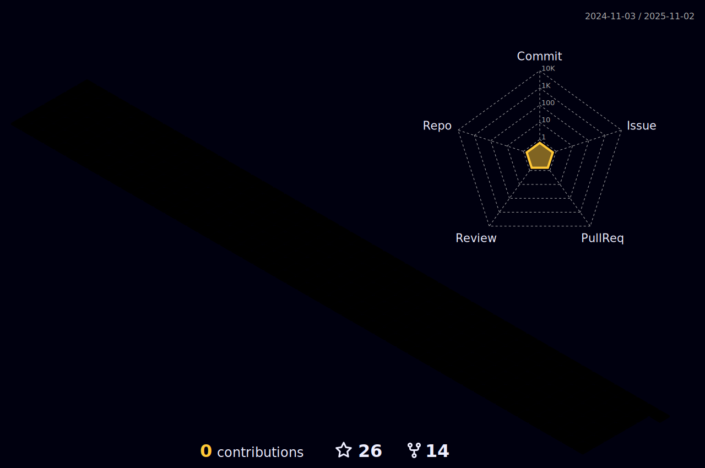

### Hi there, I'm Matthew 👋 ✨

I'm a Principal Software Architect and from New York, NY. 👨‍💻

When problems surface, I **methodically** turn them into _opportunities_.

My stewardship keeps me intensely rooted from ideation to code with the intensity for focusing on methodologies that maximize outputs and minimizes inputs. By setting into motion, a “mentoring is implied” culture in a self-governing environment influenced by the strict practice of agile principles, a center of gravity begins to form around the requirements.

The anatomy of my approach, the composition of strategic units that delivers consistent results with discipline & maturity is the foundation for attracting exceptionally smart people, that you can remarkably trust. What this will achieve will blow you away!

Today’s proliferation of technology necessitates a paradigm shift in talent acquisition where being multi-disciplined is a pre-requisite, and having a healthy disregard for the status quo is now a stipulation.

Fully embracing my autodidactic nature has facilitated the rapid ability to educate myself to advanced levels beyond the attainability of the traditional outlets in today’s industry. Because of this, I excel naturally in multi-disciplined environments, roles & capacities.

- ⚡ I roll deep in devops, kubernetes, architecture design & implementation, and application development.
- 💬 Ask me about how to create resilient and scalable architectures 😄
- 📫 How to reach me: by [email](mailto:matthew@matthewdavis.io) or [mateothegreat#0001](https://discordapp.com/users/505520869246763009) on Discord.

---

### What's up now?

I'm presently in the process of developing a sophisticated camera surveillance platform. This robust platform is designed to securely store video footage, ensuring that critical data isn't lost. More than just a storage solution, it's equipped to process the stored footage through an advanced machine learning pipeline. The purpose of this pipeline is to perform video analytics, providing insightful data that can be leveraged in various ways. Additionally, it's capable of motion detection, identifying any movement within the video frames and triggering alerts if necessary. Beyond these capabilities, the platform also offers additional features to further enhance its utility and effectiveness.

This platform has been designed using fault tolerant microservices backed by kubernetes.

---

